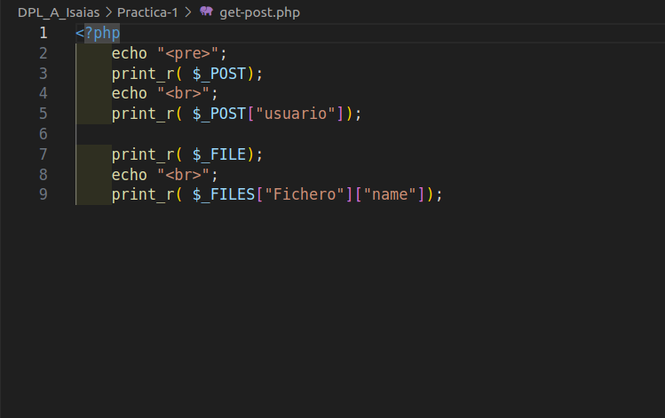

# Métodos POST y GET

## Explicación de métodos
Los métodos GET y POST son los más importantes que ofrece php para el protocolo HTTP y tienen diferentes ventajas e inconvenientes que ofrecer
- Método GET: Tiene un límite de unos 2000 caracteres, no admite archivos y ofrece poca seguridad, ya que los parámetros se indican en la URL.
- Método POST: No tiene límite y acepta archivos, además ofrece un poco más de seguridad al pasar los parámetros junto con la solicitud del HTTP

## Su uso
1. Debemos crear un fichero index.php por donde pasar los datos a través de, por ejemplo, un formulario. 
2. Luego en un fichero get-post.php lo recogemos con el método POST o GET de la misma manera uno que otro solo habría que cambiar POST por GET o viceversa. 
3. Lo hacemos con GET y quedaría así.

3. En este caso lo hacemos con un post para recoger también un fichero que le pasemos.
