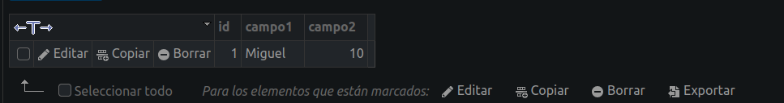

# Tarea con Base de Datos en nuestro servidor

## Crear la Base de Datos
- Aprovechando la interfaz gráfica de phpMyAdmin creamos una base de datos "prueba".

- En ella tenemos que crear al menos una tabla para realizar luego la conexión.

## Hacer conexión mediante PHP
- Creamos la conexion con el `mysqli_connect()` y usamos esta conexión para conectar con la BBDD y con ella hacemos un insert `mysqli_query()`, luego hay que acordarse de cerrar la conexión `mysqli_close()`.
- Nos saldrá un mensaje en la página de la conexión

- Comprobamos que la inserción se ha realizado con exito
