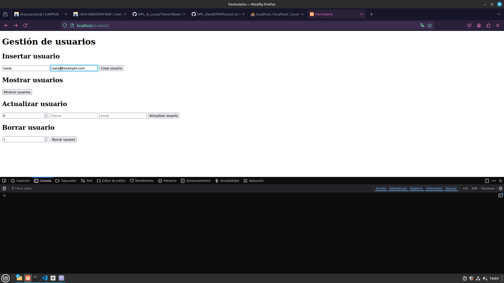
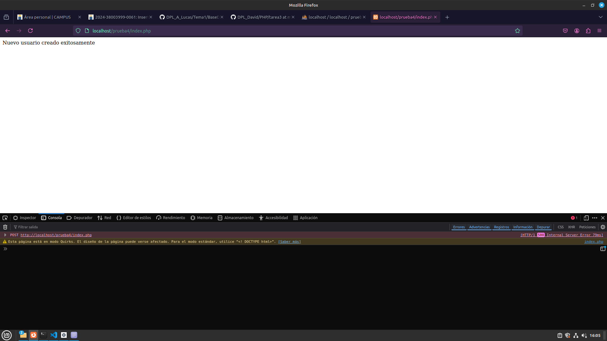
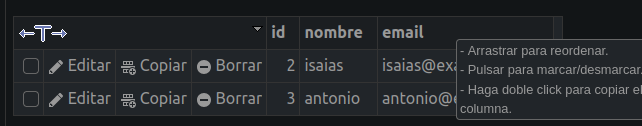
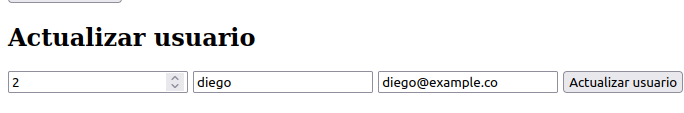
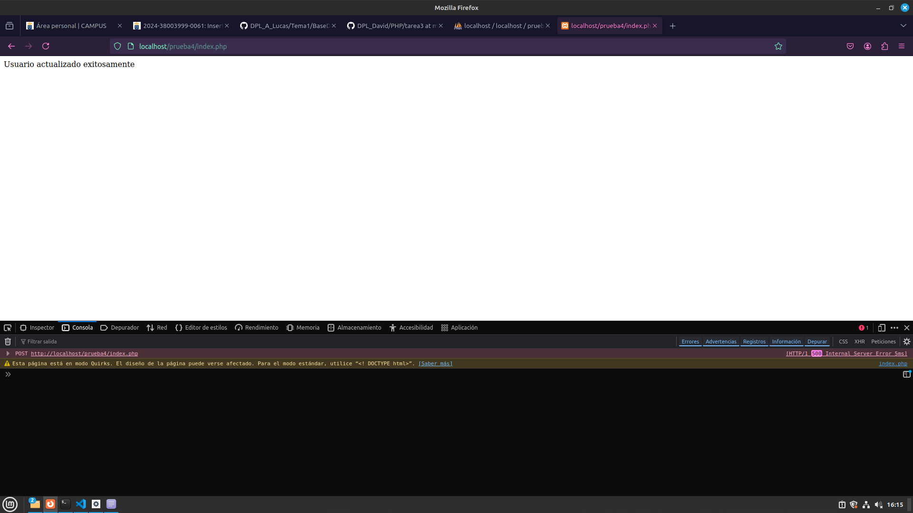
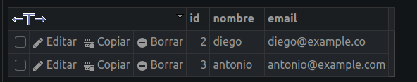

# Insertar, leer, modificar y borrar registros de la base de datos

## Crear el HTML con los 4 formularios
```html
<!DOCTYPE html>
<html lang="en">
<head>
    <meta charset="UTF-8">
    <meta name="viewport" content="width=device-width, initial-scale=1.0">
    <title>Formulario</title>
</head>
<body>
    <h1>Gestión de usuarios</h1>
    <h2>Insertar usuario</h2>
    <form action="index.php" method="post">
        <input type="text" name="name" placeholder="Name" required>
        <input type="email" name="email" placeholder="email" required>
        <button type="submit" name="insert">Crear usuario</button>
    </form>

    <h2>Mostrar usuarios</h2>
    <form action="index.php" method="post">
        <button type="button" name="select">Mostrar usuarios</button>
    </form>

    <h2>Actualizar usuario</h2>
    <form action="index.php" method="post">
        <input type="number" name="userId" placeholder="User ID" required>
        <input type="text" name="name" placeholder="Name" required>
        <input type="email" name="email" placeholder="email" required>
        <button type="submit" name="update">Actualizar usuario</button>
    </form>

    <h2>Borrar usuario</h2>
    <form action="index.php" method="post">
        <input type="number" name="userId" placeholder="User ID" required>
        <button type="submit" name="delete">Borrar usuario</button>
    </form>
</body>
</html>
```

## Crear el php con cada una de las sentencias y la conexión a la BBDD

```php
<?php
$servername = "localhost"; // El servidor somos nosotros es el local
$username = "root"; // El usuario
$password = "E3Mt]_ZK8joVSC7Z"; // La contraseña para acceder al administrador. Esto no es seguro hacerlo pero no pasa nada si es solo una prueba
$dbname = "prueba"; // Nombre de la base de datos

// Creamos la conexión
$conn = new mysqli($servername, $username, $password, $dbname);

// Verificamos la conexión
if ($conn->connect_error) {
    die("Conexión fallida: " . $conn->connect_error);
}

// Insertamos el usuario
if (isset($_POST['insert'])) {
    $name = $_POST['name'];
    $email = $_POST['email'];

    $sql = "INSERT INTO users (nombre, email) VALUES ('$name', '$email')"; // La sentencia SQL de inserción
    if (mysqli_query($conn, $sql) === TRUE) { // Es recomendable que verifiquemos si hay errores
        echo "Nuevo usuario creado exitosamente";
    } else {
        echo "Error: " . $sql . "<br>" . $conn->error;
    }
}

// Mostramos los usuarios
if (isset($_POST['select'])) {
    $sql = "SELECT * FROM users";
    $result = mysqli_query($conn, $sql);

    if ($result->num_rows > 0) {
        while($row = $result->fetch_assoc()) {
            echo "ID: " . $row["id"]. " - Nombre: " . $row["nombre"]. " - Email: " . $row["email"]. "<br>";
        }
    } else {
        echo "0 resultados";
    }
}

// Actualizamos los usuarios
if (isset($_POST['update'])) {
    $userId = $_POST['userId'];
    $name = $_POST['name'];
    $email = $_POST['email'];

    $sql = "UPDATE users SET nombre='$name', email='$email' WHERE id=$userId"; // La sentencia SQL de actualizción
    if (mysqli_query($conn, $sql) === TRUE) {
        echo "Usuario actualizado exitosamente";
    } else {
        echo "Error actualizando usuario: " . $conn->error;
    }
}

// Borramos el usuario
if (isset($_POST['delete'])) {
    $userId = $_POST['userId'];

    $sql = "DELETE FROM users WHERE id=$userId"; // La sentencia SQL de eliminación
    if (mysqli_query($conn, $sql) === TRUE) {
        echo "Usuario borrado exitosamente";
    } else {
        echo "Error borrando usuario: " . $conn->error;
    }
}

mysqli_close();
?>
```

## Probamos a hacer algunas operaciones










