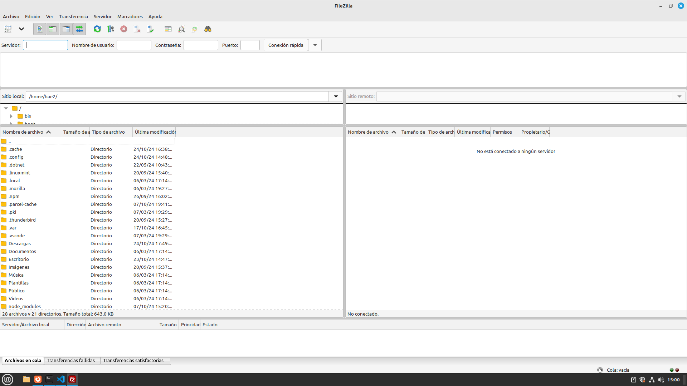
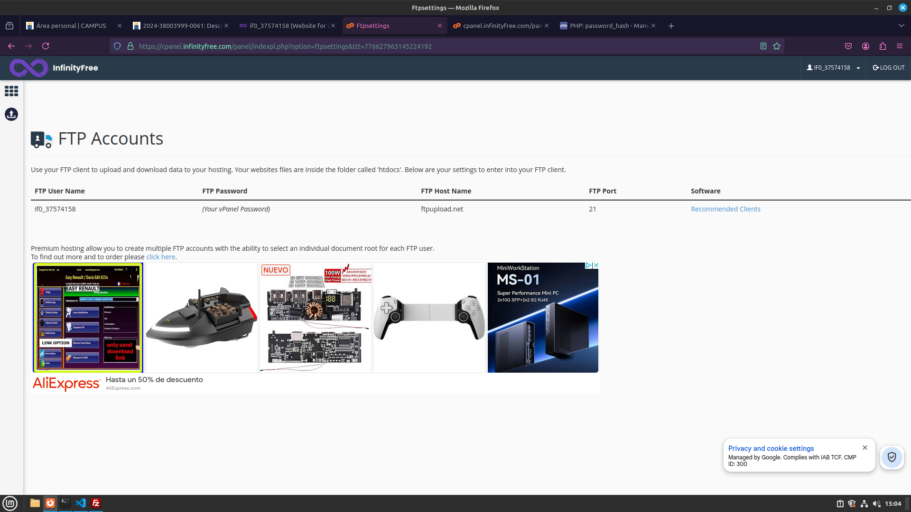
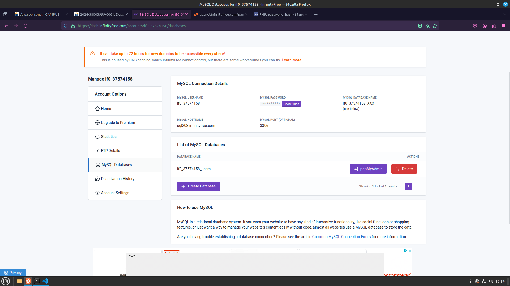
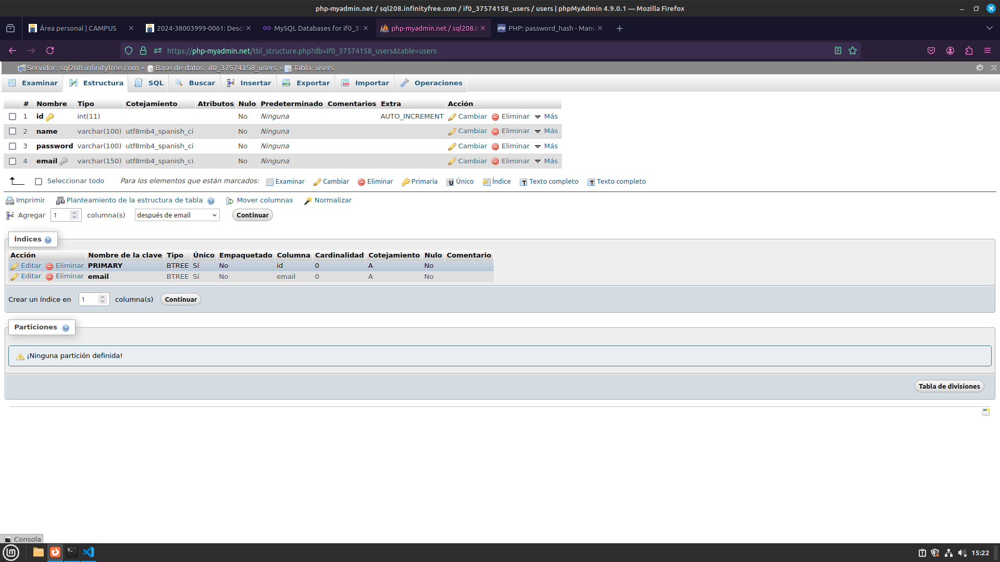

# Alojando los archivos de XAMPP en InfinityFree

## Crear una cuenta de InfinityFree
- Creamos la cuenta en InfinityFree si no está ya creada, luego hacemos login y entramos al home, donde creamos una cuenta de página web.

## Descargar FileZilla
- Descargamos FileZilla a través del gestor de paquetes de Linux y lo abrimos

## Conectarnos con FileZilla
- Entramos a FileZilla y veremos esta pantalla:

- Tendremos que completar los campos de arriba para establecer la conexión. Para ello nos vamos al panel de control de InfinityFree y buscamos FTP account, entramos ahí. 
Veremos una pantalla como esta

- Copiamos los datos mostrados al FileZilla.

## Copiar los archivos de XAMMP.
- Una vez con la conexión establecida copiamos los archivos que tenemos en el htdocs del XAMPP al htdocs del administrador de archivos de InfinityFree a través de FileZilla.

## Crear base de datos.
- Una vez pasados los archivos, solo tenemos que crear una base de datos en InfinityFree.
- Dentro de nuestra cuenta web nos dirigimos a la zona de MySQL Databases y en la lista de bases de datos creamos una.
- Una vez creada entramos en PHPmyAdmin y creamos las tablas pertinentes para que las pruebas de PHP que subimos funcionen

