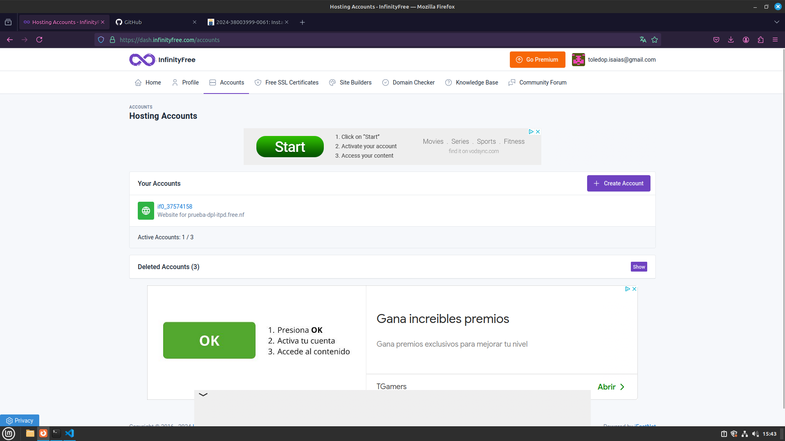
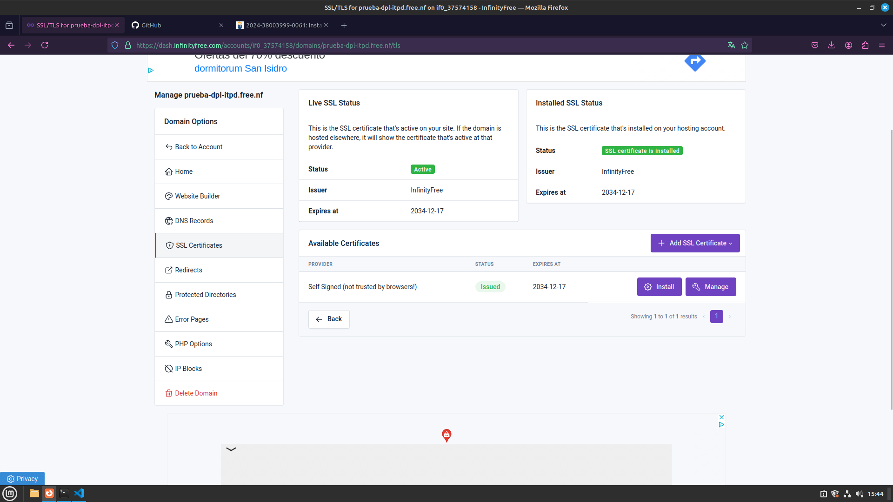

# Instalación de SSL con InfinityFree

## Paso 1: Generar un certificado SSL autofirmado con OpenSSL
Si no tienes un certificado SSL de una autoridad certificadora (CA), puedes generar un certificado autofirmado usando OpenSSL. Este tipo de certificado es adecuado para pruebas o entornos internos.

### Crear un par de claves y un certificado autofirmado
Ejecuta el siguiente comando para generar una clave privada y un certificado SSL:

```bash
sudo openssl req -x509 -nodes -days 365 -newkey rsa:2048 -keyout /etc/ssl/private/tu-dominio.key -out /etc/ssl/certs/tu-dominio.crt
```

Durante el proceso, OpenSSL te pedirá información como:

- **Country Name** (Código de dos letras del país, ej. `US` para Estados Unidos, `ES` para España).
- **State or Province Name** (Provincia o estado).
- **Locality Name** (Ciudad).
- **Organization Name** (Nombre de tu organización).
- **Common Name** (El dominio del certificado, ej. `tu-dominio.com`).

Esto generará:

- Una clave privada en `/etc/ssl/private/tu-dominio.key`
- Un certificado en `/etc/ssl/certs/tu-dominio.crt`

---

## Paso2: Instalarlo en InfinityFree

- Entramos en InfinityFree y usamos una cuenta que ya tengamos o creamos una nueva.

- En la sección de dominios vamos a manage.

- Dentro de manage vamos a manage SSL certificate.

- Ahí le damos a add SSL certificate y luego seleccionamos install self-signed SSL certificate.

- Esperamos 15 minutos a que se active.