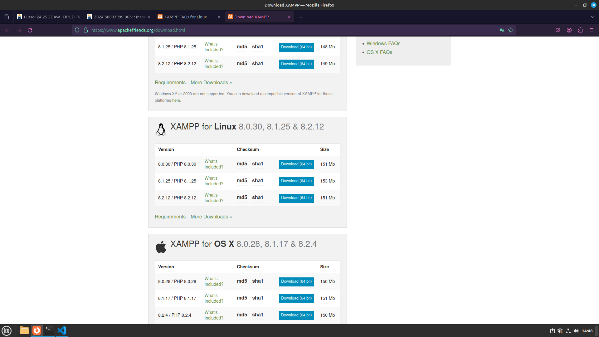
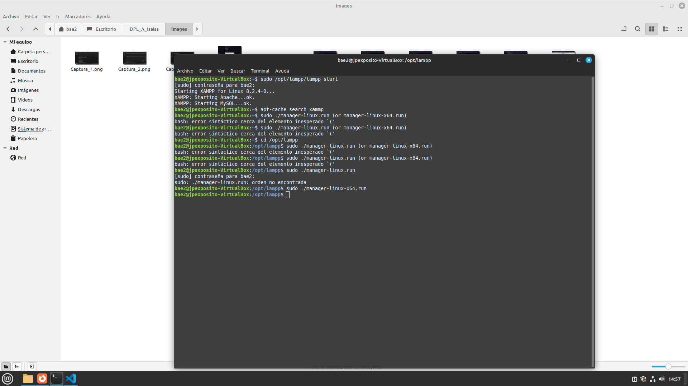
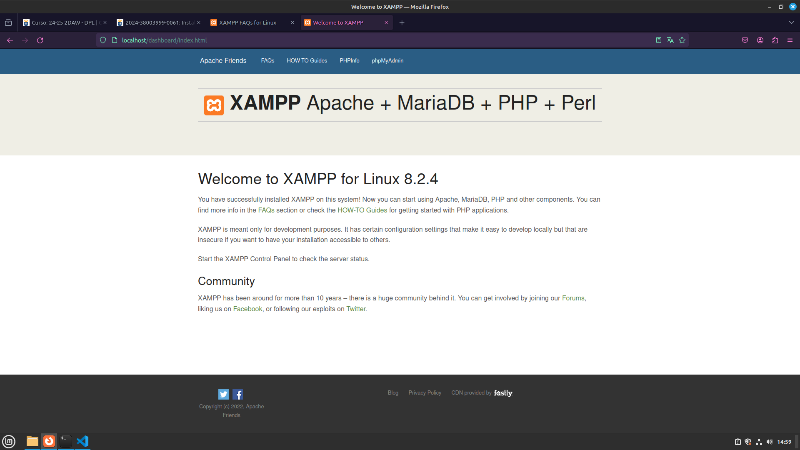

# Instalación de XAMMP en Linux

## Descargar la aplicación
- En primer lugar, se busca en los repositorios oficiales si existe dicho software
    - apt-cache search xammp
    - No da resultado
- Entonces nos vamos a la web oficial y lo descargamos

## Instalar la aplicación
- Damos permiso de ejecución al archivo
    - chmod 755 xampp-linux-*-installer.run
- Lanzamos el archivo
    - sudo ./xampp-linux-*-installer.runs
    - Esperamos a que se instale

## Arrancar el programa
- Lanzamos el comando para que arranque
    - sudo /opt/lampp/lampp start
- Lanzamos la interfaz gráfica
    - sudo ./manager-linux-x64.run

## Comprobar operatividad
- Entramos en el siguiente URL: http://localhost y nos saldría una página
