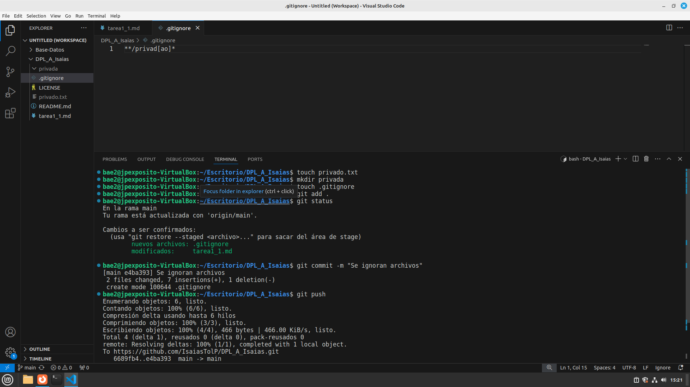

# Tarea 1.1 de GIT
## Clonación del repositorio a máquina local
- git clone https://github.com/IsaiasTolP/DPL_A_Isaias.git

## Creación del fichero de la tarea
- touch tarea1_1.md

## Commit inicial con mensaje
- git add .
- git commit -m "commit inicial"

## Push inicial
- git push

## Ignorar archivos
- touch privado.txt
- mkdir privada
- touch .gitignore

Como se observa, una vez hecho `git add .` los archivos que se han preparado para recibir el commit no son ni el directorio ni el fichero que hemos ignorado.
He decidido usar una expresión regular para dicho gitignore, para así no poner los archivos 1 a 1, aunque estos solo sean 2, ya que en un futuro podrían ser docenas de ellos y no es cuestión el añadirlos manualmente.

## Añadir el fichero 1.txt
- touch 1.txt

## Crear el tag v0.1
- git tag -a v0.1 -m "Primera version"

## Creación de tabla
| Nombre | GITHUB |
| -------|--------|
| David  | https://github.com/DavidRiccio |
| Lucas  | https://github.com/LucaPowerz |
| Cesar  | https://github.com/Cesardrom  |