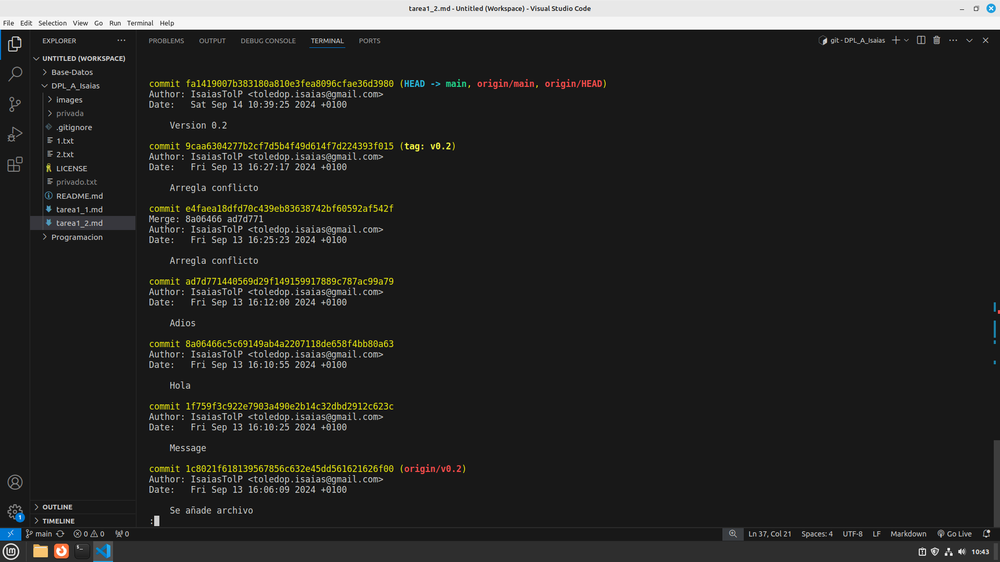

# Tarea 1.2 de GIT

## Crear la rama y posicionarse en ella.
- git checkout -b v0.2

## Crear un fichero en la nueva rama.
- touch 2.txt

## Confirmar los cambios al remoto.
- git add .
- git commit -m "Se crea rama de version v0.2"
- git push --set-upstream origin v0.2

## Merge directo
- git checkout main
- git merge v0.2

## Merge con conflicto
- Escribimos Hola en 1.txt rama main.
- Escribimos Hola en 1.txt rama v0.2.
- Hacer commit en ambas.
- Hacer merge con hacia la main.

## Listar Ramas
- git branch --no-merged
Sería la v0.2
- git branch --merged
Sería la main

## Arreglar conflictos

En la imagen vemos el solucionador de merge de VScode, he decido que mantendre el hola de la versión main.
Lo bueno de esto es que el commit de la v0.2 se mantiene intacto.

## Borrar la rama
- git tag -a v0.2 -m "Version 0.2"
- git branch -d v0.2

## Listado de Confirmaciones
- git log

## Crear una organización
- [Enlace organización](https://github.com/orgdpl-IsaiasTolP)

## Crear equipos

## Crear index.html

## Crear pull requests

## Gestionar pull requests