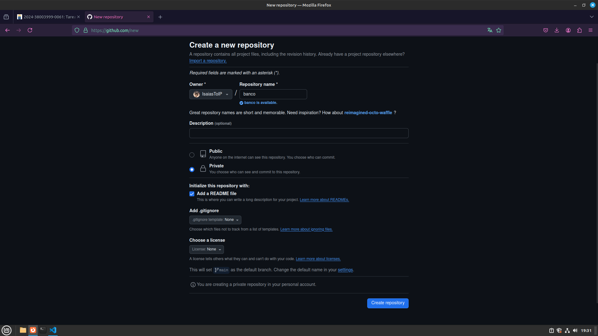
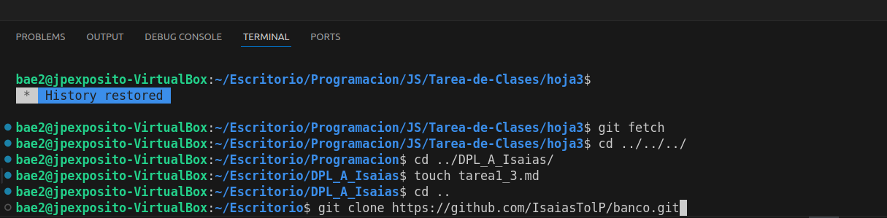
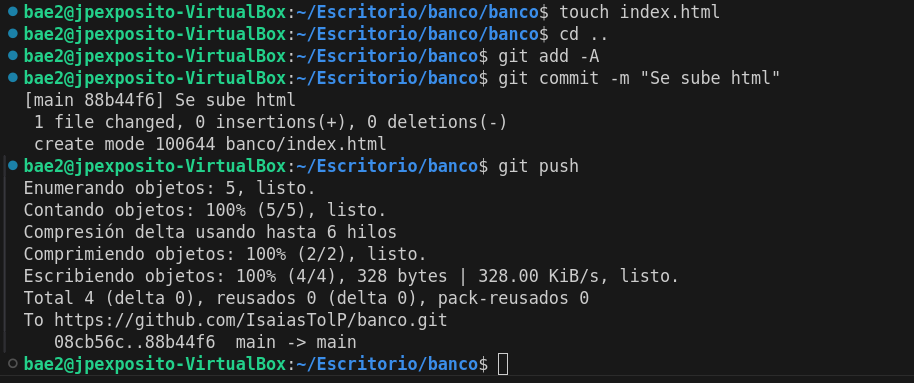
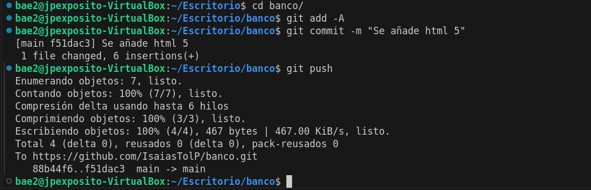

# 
Trabajando con repositorios en VSCode

## 1. Crear el repositorio Banco
- Creamos el repositorio en github.

## 2. Clonamos el repositorio a través de comandos
- Clonamos el repositorio con el comando `git clone <url https del repostorio>`.

## 3. Creamos el proyecto banco y lo incluimos en el repositorio
- Usamos el comando `mkdir` para crear la nueva carpeta y la copiamos al repositorio con el comando `cp`.
- Creamos dentro de la carpeta un fichero con `touch`, por ejemplo un .gitkeep para que la carpeta se pueda subir, ya que no se aceptan commits de carpetas vacías.

## 4. Hacemos commit
- Primero hacemos un git add -A para añadir todos los cambios hechos en el repositorio a la cola para confirmar(commit).
- Luego hacemos `git commit -m "mensaje` para hacer un commit con un mensaje informativo sobre los cambios realizados. 
- Por último hacemos un git push.

## 5. Borramos el repositorio del disco duro
- Simplemente borramos el repositorio, sea mediante un comando `rm -rf` o con el entorno gráfico.

## 6. Volvemos a clonar el repositorio
- Volvemos a usar el `git clone <url https del repostorio>` para volver a clonar el repositorio y los cambios guardados estarán en el repositorio ya que hicimos un `push` previo.

## 7. Hacemos un cambio y lo volvemos a subir
- Por ejemplo, creamos un html y le escribimos la plantilla de `html:5`. Luego le hacemos el commit y el push.
