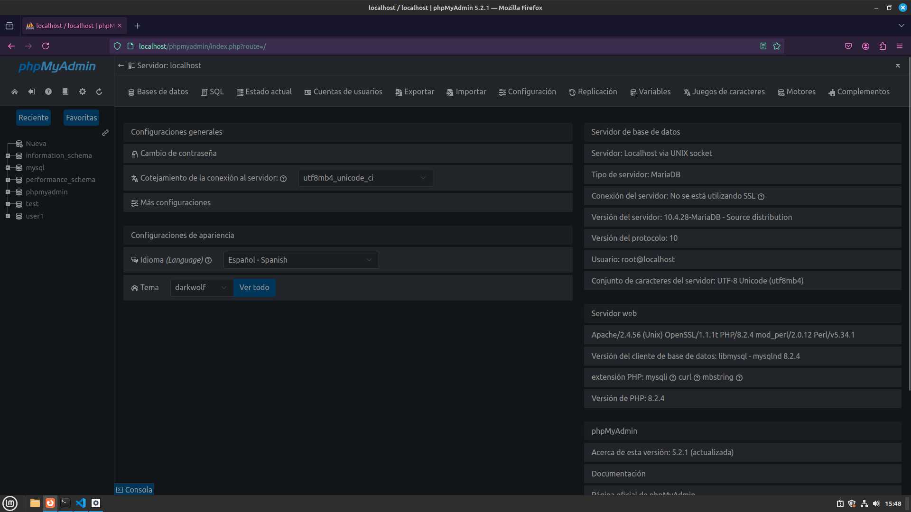
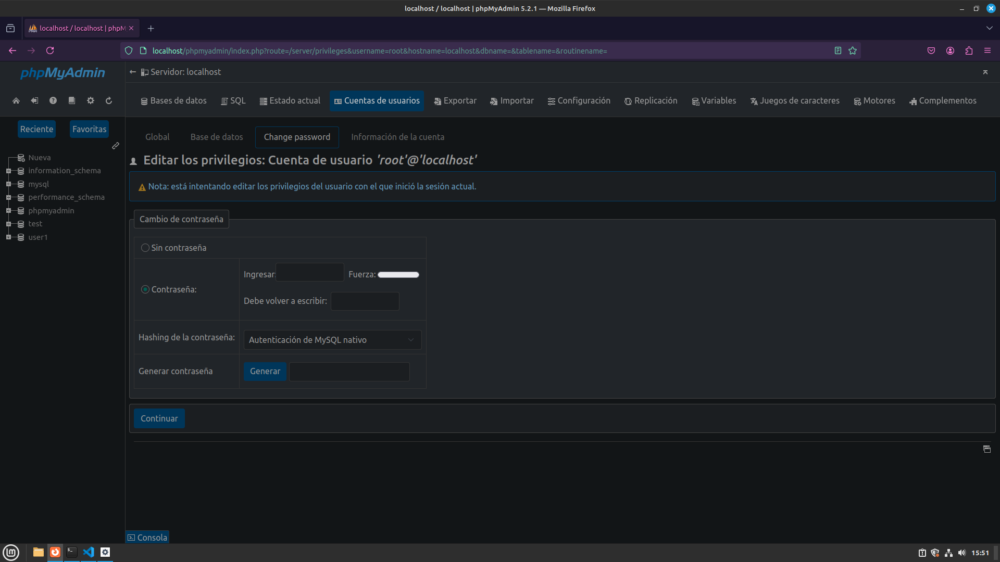
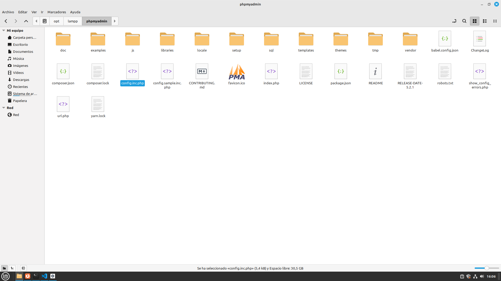
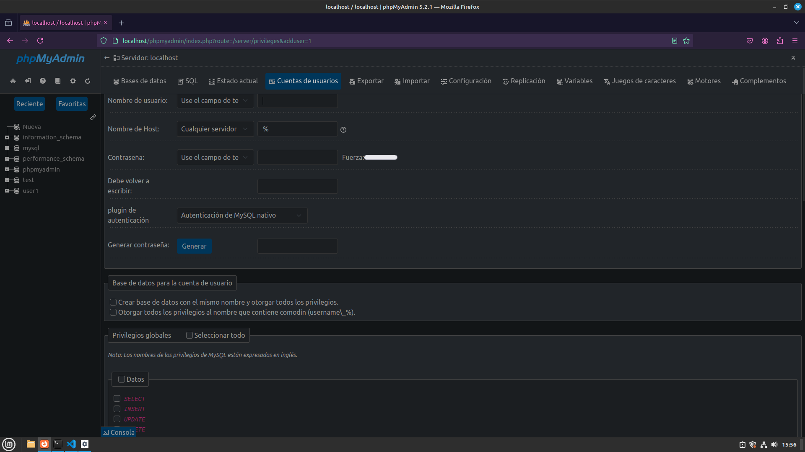

# Securizando el xammp

## Acceder al xammp
- Entramos a la siguiente URL con el xammp encendido: http://localhost

- Entramos a la sección de PHPmyAdmin

## Cambiar la contraseña al root
- Nos movemos a la parte cuentas de usuario y buscamos al usuario root con servidor localhost y hacemos click.
- Ahora hacemos click en la opción que sale de "change password".
- Aquí cambiaremos la contraseña a una segura.

- Ahora debemos tocar unos archivos de configuración para que acepte el login del root ya que es un usuario con todos los permisos.
- Vamos a la carpeta "/opt/lammp/phpmyadmin" y aquí abrimos el fichero config.inc.php (Debemos ser superusuario).

- Vamos a la línea donde se encuentre "Authentication type" y luego en la línea `$cfg['Servers'][$i]['password']` introducimos la contraseña después del igual.

## Crear un nuevo usuario con menos permisos críticos
- Para ello volvemos a la sección de cuentas de usuarios y pinchamos en "crear nuevo usuario"
- Aquí nos pedirá los datos de este (nombre, servidor y contraseña)
- Luego seleccionaremos si queremos que se cree una base de datos para este nuevo usuario.
- Por último, le asignamos los permisos del xammp que creamos necesarios y aceptamos la creación del usuario.
